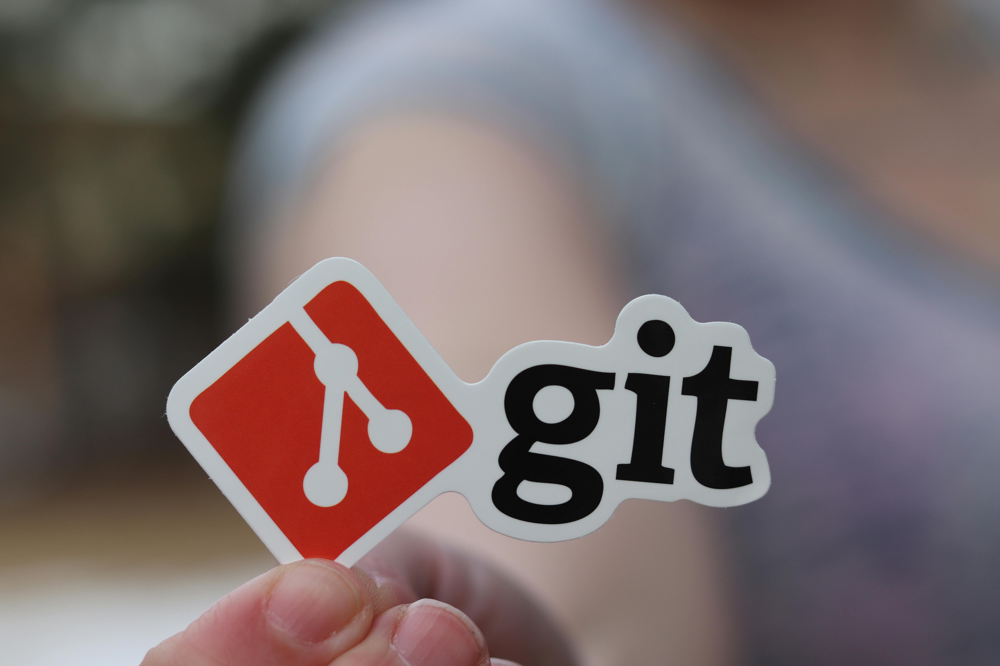

#  SBA 1: Version Control Simulation

[Karl Johnson](https://www.github.com/hirekarl)  
PS 2025-RTT-30
<date datetime="2025-06-04">2025-06-04</date>  

## Project Reflection

### Prompt
In a document or Markdown file, write a reflection of approximately 300 words, addressing the following:
- The steps you took to create and manage branches.
- How you handled the merge conflict.
- How the pull request process helped you ensure code quality and collaboration.

### Response
After creating the repository on GitHub, cloning it to my workspace, and committing the initial boilerplate `index.html` to `main`, I created and moved to a new feature branch, `feature/header`, off of `main` to handle work to be done on the header, with `git checkout -b feature/header`.

I added a header to `index.html`, then staged and committed the new changes to `feature/header`.

I moved back to `main` by running `git checkout main`.

From `main`, I ran `git checkout -b feature/footer` to create a new feature branch, `feature/footer`, and added a footer section. I then committed these to `feature/footer`.

I moved back to `main` by running `git checkout main`.

I then attempted to merge `feature/footer` to `main`, which succeeded with a simple fast-forward.

When I attempted to then merge `feature/header` to `main`, I ran into a merge conflict.

To resolve the conflict, I combined the results of both incoming files and cleaned up the `git` text markers left over from the merge. I then staged `index.html` and committed it to `main`.

I then went to the repo on GitHub and created a change to `index.html` directly in the web editor, and committed it to a new branch, `review/main`.

I went back to the root of my repo, where I saw a message indicating the push from `review/main` and an opportunity to create a pull request. I did so.

I then added a comment to the pull request and merged `review/main`.

If there had been any issues raised or created by the contents of the pull request from `review/main`, GitHub's UI provided an opportunity for me to reject and comment on the change until the conditions specified by the code reviewer/approver were met.

Pull requests allow teams to suggest changes, deliberate about them, and iterate on solutions until code meets standards of quality control. Since they continue to live in the repo after merges are accepted, a full paper trail continues to exist in GitHub regarding what revisions were accepted, rejected, or remain open; and the conversations around the codebase are preserved for posterity.

### Attributions
- Photo by RealToughCandy.com: https://www.pexels.com/photo/person-holding-a-small-paper-11035539/